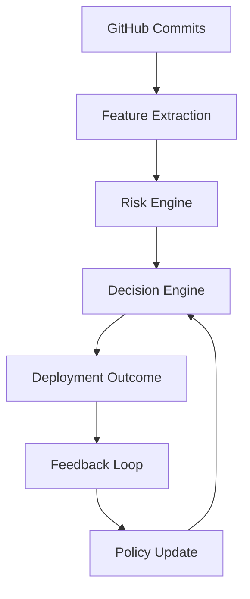

# Architecture

## System Overview

The adaptive release controller is a modular deployment decision system built around the MAPE-K feedback loop. It collects deployment signals, extracts features, estimates release risk, converts risk into a deployment decision, observes the outcome, and updates future policy thresholds using historical evidence.

The full pipeline is:

```text
GitHub -> Ingestion -> Features -> Risk Engine -> Decision Engine -> Feedback Loop -> Knowledge Base
```

This architecture separates prediction from action. The risk engine estimates how dangerous a release is, while the decision engine converts that risk into an operational choice. The feedback loop then learns from the outcome and writes an updated policy artifact that can influence future decisions.

## MAPE-K Loop Explanation

| MAPE-K Stage | Project Behavior |
| --- | --- |
| Monitor | Collect deployment records, decisions, risk scores, and final outcomes. |
| Analyze | Compute success rate, failure rate, false positive rate, and false negative rate. |
| Plan | Decide whether thresholds should become more conservative or less conservative. |
| Execute | Save the adjusted deployment policy as a learned threshold artifact. |
| Knowledge | Persist historical deployment data and learned policy outputs for future evaluation. |

The feedback loop is intentionally implemented as a policy layer. It does not rewrite the risk model or hardcode new decision rules into the decision engine. Instead, it produces a learned policy file that can be loaded during evaluation or future deployment control.

## Components

| Component | Path | Responsibility |
| --- | --- | --- |
| GitHub ingestion | `ingestion/github_client.py` | Collect commit and CI/CD metadata from GitHub sources. |
| Feature extraction | `features/extractor.py` | Convert raw commit and CI data into structured deployment features. |
| Risk engine | `risk_engine/model.py` | Calculate normalized deployment risk scores from extracted features. |
| Decision engine | `decision_engine/engine.py` | Convert a risk score into DEPLOY, CANARY, or BLOCK decisions using thresholds. |
| Feedback loop | `knowledge_base/learning.py` | Analyze historical outcomes and adapt decision thresholds. |
| Evaluation | `experiments/evaluation.py` | Compare Static, Risk-only, and Adaptive systems using common metrics. |

## Data Flow

Deployment data begins with GitHub commit and CI/CD signals. The ingestion layer collects information such as commit SHA, files changed, lines added, lines deleted, test status, coverage, and CI duration. The feature extraction layer normalizes this information into fields that can be stored and evaluated consistently.

The risk engine reads these features and produces a normalized risk score between 0.0 and 1.0. A lower score indicates lower deployment risk, while a higher score indicates higher deployment risk. The decision engine then maps the score into an action:

- DEPLOY for low-risk changes
- CANARY for medium-risk changes
- BLOCK for high-risk changes

After the decision is made, the deployment outcome is recorded. Outcomes are stored in the knowledge base so the system can later compare what it predicted against what actually happened.

## Decision Flow

```text
risk_score -> decision -> outcome -> feedback -> updated policy
```

The decision flow works as follows:

1. A deployment record is converted into a risk score.
2. The decision engine applies thresholds to produce DEPLOY, CANARY, or BLOCK.
3. The system observes the deployment outcome as success or failure.
4. The feedback loop computes false positives and false negatives.
5. The learned policy updates deploy and block thresholds when reliability tradeoffs require adaptation.

For example, if the system allows too many failed deployments, the false negative rate increases. The feedback loop responds by lowering thresholds, making the controller more conservative in future decisions.

## Architecture Diagram



## Design Principles

### Modular

Each major concern is separated into its own package. Ingestion, feature extraction, risk scoring, decisioning, learning, and evaluation can be improved independently without rewriting the entire system.

### Data-Driven

Deployment decisions are based on recorded features and historical outcomes instead of manual intuition alone. The knowledge base provides a reproducible foundation for evaluation.

### Adaptive

The system changes its behavior based on observed outcomes. When false negatives become too high, the controller lowers thresholds to reduce risky approvals. When false positives become too high, the controller can raise thresholds to reduce unnecessary blocking.

### Explainable

The controller uses explicit metrics, thresholds, and policy artifacts. Each decision can be traced back to a risk score and threshold configuration, making the system easier to debug, evaluate, and present in research settings.

## Research Boundary

The current prototype focuses on deployment decision quality rather than production orchestration. Kubernetes deployment, real rollback execution, and live observability integration are future extensions. This boundary keeps the research focused on the central question: whether adaptive feedback improves deployment reliability compared with static CI/CD gates.
