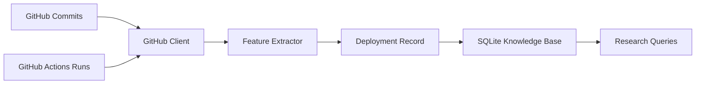

# Phase 1: Data Foundation

## Goal

Build the data pipeline and storage layer that will become the knowledge base for the self-adaptive deployment system.

## Purpose

This phase collects deployment history so the system can learn from previous commits, CI results, deployment decisions, and outcomes. The knowledge base created here will later support risk scoring, adaptive threshold tuning, rollback analysis, and baseline comparison.

## What We Build

- GitHub commit ingestion
- CI/CD run ingestion
- feature extraction from commits and CI signals
- persistent storage for deployment records
- queryable knowledge base

## Components

```text
ingestion/github_client.py
features/extractor.py
knowledge_base/db.py
```

## Data Flow



## Core Data Schema

```sql
CREATE TABLE deployments (
  id INTEGER PRIMARY KEY,
  commit_sha TEXT NOT NULL,
  files_changed INTEGER NOT NULL,
  lines_added INTEGER NOT NULL,
  lines_deleted INTEGER NOT NULL,
  test_passed BOOLEAN NOT NULL,
  ci_duration FLOAT NOT NULL,
  risk_score FLOAT NOT NULL,
  decision TEXT NOT NULL,
  outcome TEXT NOT NULL,
  created_at TIMESTAMP DEFAULT CURRENT_TIMESTAMP
);
```

## Data Fields

| Field | Meaning |
| --- | --- |
| `commit_sha` | Unique GitHub commit identifier |
| `files_changed` | Number of files modified |
| `lines_added` | Total added lines |
| `lines_deleted` | Total deleted lines |
| `test_passed` | Whether CI tests passed |
| `ci_duration` | Total CI runtime in seconds |
| `risk_score` | Calculated deployment risk from `0.0` to `1.0` |
| `decision` | Deployment controller action: `deploy`, `block`, or `rollback` |
| `outcome` | Final deployment result: `success`, `failure`, or `unknown` |
| `created_at` | Record creation time |

## Dataset Scope

Initial dataset size: 50-200 deployment records.

Data may include:

- real GitHub repository history
- GitHub Actions CI runs
- simulated deployment outcomes if real production outcomes are unavailable

For the first research iteration, production outcomes may be simulated while commit and CI metadata can be real. This keeps the prototype practical while preserving the ability to compare static and adaptive deployment decisions.

## Exit Criteria

Phase 1 is complete when:

- the system has collected 50-200 deployment records
- records are stored in a database
- past deployments can be queried
- feature extraction works consistently
- each record includes both CI signals and deployment outcome

## Research Importance

This phase is critical because the quality of the adaptive system depends directly on the quality of the data. Bad data will produce unreliable risk scores, poor rollback decisions, and weak research results.

