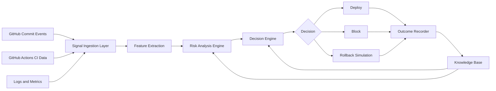

# Self-Adaptive Deployment Controller Using MAPE-K Feedback Loop

## Research Question

Can a self-adaptive feedback loop improve deployment reliability compared to static CI/CD pipelines?

## Problem

Modern CI/CD pipelines are mostly static. They pass or fail deployments based on fixed rules such as build status, test status, and coverage thresholds. These rules are useful, but they do not adapt to historical deployment outcomes, changing service risk, commit patterns, or rollback quality. As a result, teams can still ship high-risk changes, block safe changes unnecessarily, or make poor rollback decisions during incidents.

This project investigates whether a self-adaptive deployment controller based on the MAPE-K loop can improve deployment decisions by continuously monitoring signals, analyzing deployment risk, planning an action, executing that action, and updating a knowledge base with the outcome.

## Baseline

The baseline is a traditional static CI/CD gate. A deployment is allowed only when:

- tests pass
- build passes
- coverage is above a configured threshold

This baseline does not use historical deployment outcomes, dynamic risk scoring, or feedback from prior rollback/block decisions.

## Proposed System

The proposed system is a MAPE-K adaptive deployment controller:

- Monitor: collect commit metadata, CI results, logs, metrics, and deployment outcomes
- Analyze: calculate deployment risk from extracted features
- Plan: choose whether to deploy, block, or rollback
- Execute: apply the selected deployment decision
- Knowledge: store historical features, decisions, and outcomes for future adaptation

For the first version, the system boundary is:

```text
GitHub Actions -> Risk Analyzer -> Decision Engine -> Deploy / Block -> Store Outcome
```

Rollback will be simulated initially so the research can focus on decision quality before adding real infrastructure automation.

## Architecture Diagram



## Metrics

The system will be evaluated using:

- deployment success rate
- mean time to recovery (MTTR)
- false rollback rate
- prediction accuracy

These metrics compare the static CI/CD baseline against the adaptive controller.

## First Prototype

The first prototype is a local Python system that reads GitHub commit and CI data, extracts deployment risk features, calculates a risk score, makes a deploy/block decision, and stores the decision and outcome in SQLite.

Initial features include:

- commit size
- files changed
- test result
- build result
- CI duration
- coverage percentage
- dependency changes
- risky directories touched
- previous failure history
- deployment outcome

Initial outputs include:

- risk score
- decision: deploy or block
- simulated deployment outcome
- stored historical record

## Seven-Day Plan

Day 1: write research plan and architecture diagram.

Day 2: create repository structure and SQLite schema.

Day 3: ingest GitHub Actions and commit metadata.

Day 4: build simple risk scoring engine.

Day 5: build deploy/block decision engine.

Day 6: run experiment comparing static rules against adaptive rules.

Day 7: write initial results and identify next research iteration.

## Expected Contribution

The expected contribution is an experimental self-adaptive deployment controller that demonstrates whether feedback-driven deployment decisions can reduce failed deployments and improve rollback/block accuracy compared to static CI/CD gates.
