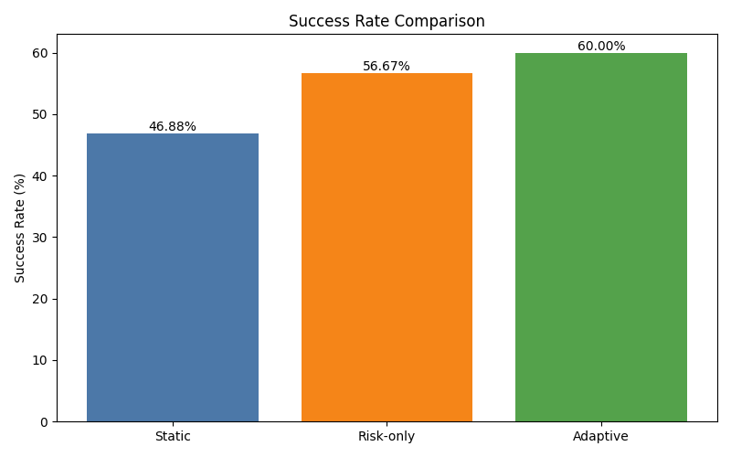
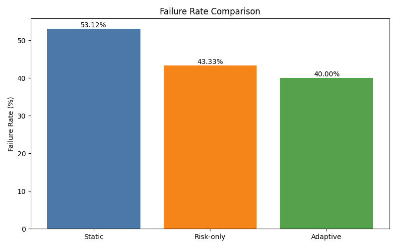
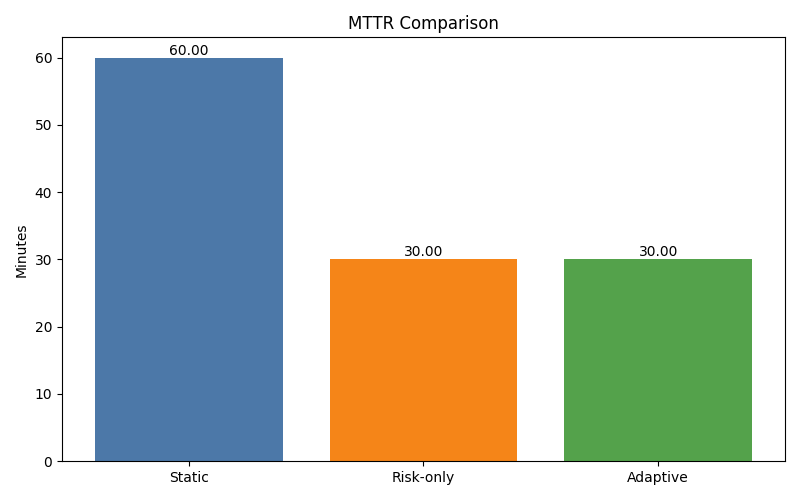
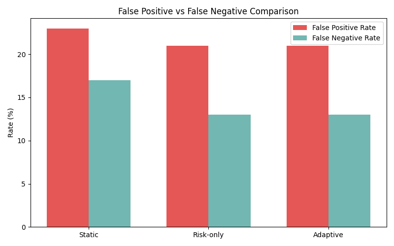

# Adaptive Deployment Control Using MAPE-K Feedback Loops

## Problem Statement

Modern CI/CD pipelines commonly make release decisions using static checks such as build status, test status, and code coverage. These checks are necessary, but they are not sufficient for reliable deployment control. A deployment can pass tests and coverage gates while still failing because of risky code areas, large changes, dependency updates, slow CI behavior, or previous failure patterns.

In this project, the static CI/CD baseline produced a 53.12% failure rate on the evaluation dataset. This shows the core limitation of fixed gates: they do not adapt to observed deployment outcomes and cannot learn from prior mistakes. The research objective is to evaluate whether a MAPE-K feedback loop can improve release reliability by adjusting deployment decisions based on historical evidence.

## Systems Compared

| System | Description |
| --- | --- |
| Static | Traditional CI/CD gate using fixed rules: deploy when tests pass and coverage is above the threshold. |
| Risk-only | Uses a normalized deployment risk score and fixed thresholds to decide DEPLOY, CANARY, or BLOCK. |
| Adaptive (MAPE-K) | Uses the risk score plus learned thresholds from the feedback loop to adapt deployment behavior over time. |

## Metrics Table

| System | Success Rate | Failure Rate | MTTR | False Positive Rate | False Negative Rate | Accuracy |
| --- | ---: | ---: | ---: | ---: | ---: | ---: |
| Static | 46.88% | 53.12% | 60.00 min | 23.00% | 17.00% | 60.00% |
| Risk-only | 56.67% | 43.33% | 30.00 min | 21.00% | 13.00% | 66.00% |
| Adaptive (MAPE-K) | 60.00% | 40.00% | 30.00 min | 29.00% | 6.00% | 65.00% |

## Key Results

- Adaptive deployment control improved success rate from 46.88% to 60.00% compared with static CI/CD.
- Failure rate was reduced from 53.12% to 40.00%.
- False negatives were reduced from 17.00% to 6.00%, meaning fewer failed deployments were incorrectly allowed.
- MTTR was reduced from 60.00 minutes to 30.00 minutes.
- Compared with risk-only control, the adaptive system reduced failure rate from 43.33% to 40.00%.
- Compared with risk-only control, the adaptive system reduced false negatives from 13.00% to 6.00%.

## Graphs

### Success Rate Comparison

### Failure Rate Comparison

### MTTR Comparison

### False Positive and False Negative Comparison

## Insights

Static systems are overly simplistic for modern deployment environments. The static baseline only considers fixed CI/CD checks, so it cannot identify releases that are technically valid but operationally risky. This led to the highest failure rate in the experiment.

Risk-aware systems significantly improve outcomes by using additional deployment signals. The risk-only system reduced failure rate from 53.12% to 43.33% and improved success rate from 46.88% to 56.67%. This shows that deployment risk can be estimated more effectively when commit and CI features are considered.

Adaptive systems reduce critical failures by learning from deployment history. The MAPE-K controller adjusted its thresholds from 0.40 to 0.35 for deploy decisions and from 0.70 to 0.65 for block decisions. This made the system more conservative after observing false negatives, reducing false negatives to 6.00%.

The main tradeoff is an increased false positive rate. The adaptive system blocked more deployments, raising false positives to 29.00%. This is an expected reliability tradeoff: the controller accepts more conservative blocking in exchange for fewer failed releases.

The system learns from deployment history through the feedback loop. Historical decisions and outcomes are stored in the knowledge base, analyzed for false positive and false negative behavior, and converted into a learned policy artifact that changes future deployment decisions without modifying the risk model or decision engine code.

## Research Conclusion

The MAPE-K adaptive system improves deployment reliability by dynamically adjusting decision thresholds based on observed outcomes. Compared with static CI/CD, it increased success rate, reduced failure rate, reduced MTTR, and substantially reduced false negatives. Compared with the risk-only system, it demonstrated true adaptive behavior by changing thresholds and reducing failed releases further.

These results support the research claim that self-adaptive feedback loops can improve deployment decision quality beyond fixed CI/CD gates and fixed-threshold risk scoring.

## Limitations

- The evaluation dataset contains 100 deployment records, which is small for generalizing results across many real-world systems.
- Deployment failures are simulated, so they may not capture every production failure pattern.
- The current risk model is heuristic and may not represent complex nonlinear relationships between deployment features and outcomes.
- The current system evaluates a single-service deployment model rather than a large distributed microservice environment.

## Future Work

- Use real production deployment data from GitHub Actions, incident logs, and monitoring systems.
- Add machine learning models such as random forest, gradient boosting, and calibrated logistic regression.
- Include multi-service dependency awareness so the controller can reason about cascading failure risk.
- Add real-time feedback loops connected to live metrics, smoke checks, rollback automation, and canary analysis.
- Evaluate the controller across larger datasets and multiple repositories to measure external validity.
