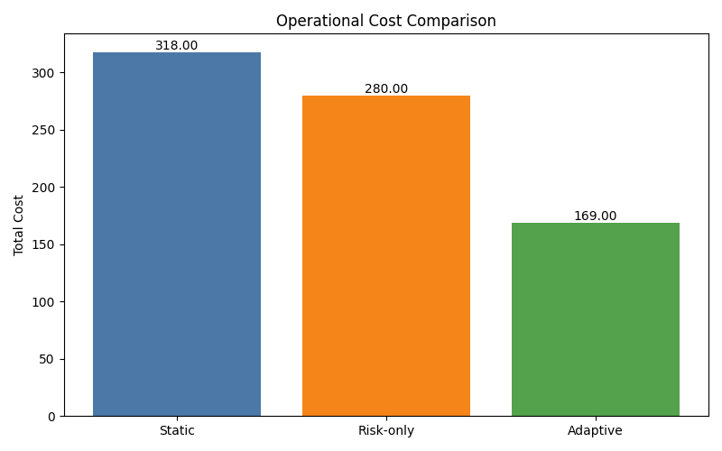

# Cost-Based Evaluation

## Research Question

Does adaptive deployment reduce total operational cost compared to static CI/CD?

## Why Cost Matters

Accuracy alone does not capture the operational impact of deployment decisions. Failed deployments create outage risk and rollback work, while false positives delay safe releases and consume engineering time. This phase evaluates each controller using a simple operational cost model that prices reliability and delivery tradeoffs together.

## Cost Model

| Cost Term | Value | Meaning |
| --- | --- | --- |
| failure_cost | 10.00 | Cost of an allowed deployment that fails. |
| false_positive_cost | 2.00 | Cost of blocking a deployment that would have succeeded. |
| canary_cost | 1.00 | Operational overhead of a canary deployment. |
| rollback_cost | 6.00 | Recovery cost after an allowed deployment fails. |

The total cost is computed as:

```text
total_cost =
  failed_deployments * failure_cost
+ false_positives * false_positive_cost
+ canary_deployments * canary_cost
+ rollbacks * rollback_cost
```

## System Cost Comparison

| System | Failed Deployments | False Positives | Canaries | Rollbacks | Deployment Velocity | Failure Cost | False Positive Cost | Canary Cost | Rollback Cost | Total Cost | Cost / Record |
| --- | --- | --- | --- | --- | --- | --- | --- | --- | --- | --- | --- |
| Static | 17 | 23 | 0 | 17 | 32.00% | 170.00 | 46.00 | 0.00 | 102.00 | 318.00 | 3.1800 |
| Risk-only | 13 | 21 | 30 | 13 | 30.00% | 130.00 | 42.00 | 30.00 | 78.00 | 280.00 | 2.8000 |
| Adaptive | 6 | 29 | 15 | 6 | 15.00% | 60.00 | 58.00 | 15.00 | 36.00 | 169.00 | 1.6900 |

## Supporting Reliability Metrics

| System | Success Rate | Failure Rate | False Positive Rate | False Negative Rate | Decision Accuracy |
| --- | --- | --- | --- | --- | --- |
| Static | 46.88% | 53.12% | 23.00% | 17.00% | 60.00% |
| Risk-only | 56.67% | 43.33% | 21.00% | 13.00% | 66.00% |
| Adaptive | 60.00% | 40.00% | 29.00% | 6.00% | 65.00% |

## Graph Output



| Graph | Path |
| --- | --- |
| Cost comparison | `experiments/results/graphs/cost_comparison.png` |

## Key Result

The lowest-cost system is **Adaptive** with total cost `169.00` and cost per record `1.6900`.

## Research Interpretation

The adaptive controller produces the lowest total operational cost because it prevents more expensive failed deployments and rollbacks, even though it creates more false positives. Compared with static CI/CD, adaptive control reduces cost by `149.00` units (46.86%). Compared with risk-only control, adaptive control reduces cost by `111.00` units (39.64%). This supports the research claim that feedback-adjusted deployment control can reduce total deployment risk cost, not only improve accuracy-style metrics.
