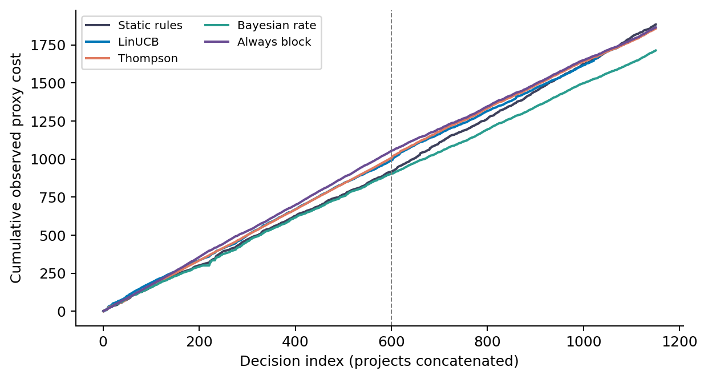
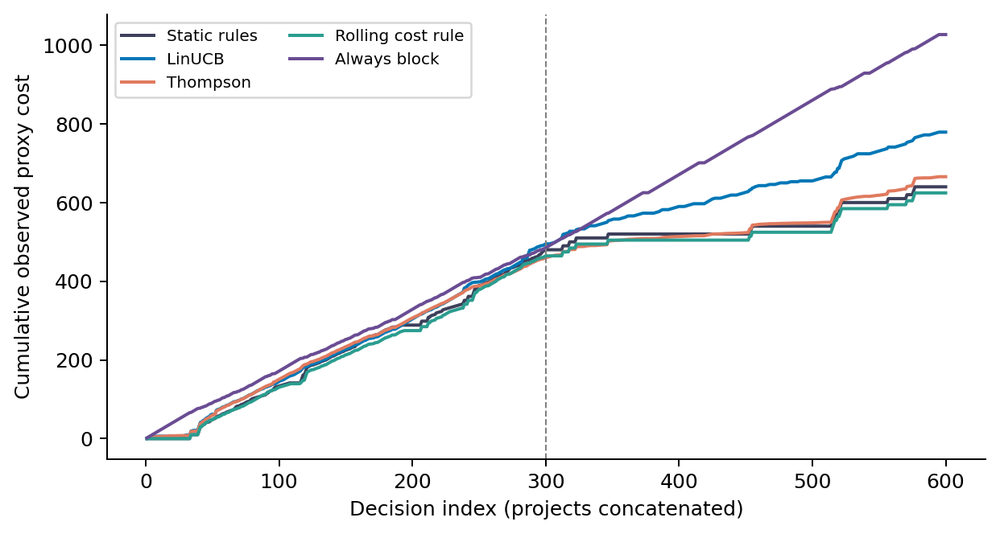
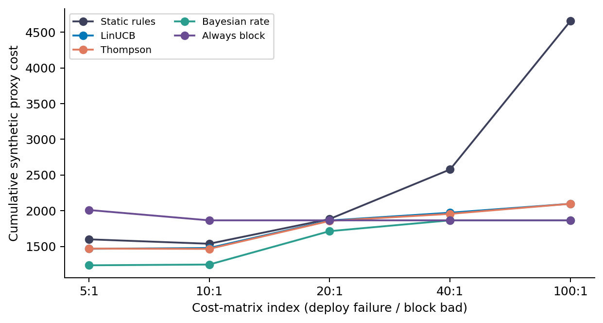

# Abstract

We study whether contextual bandits improve a three-action cost decision in a simulation driven by continuous-integration (CI) outcomes. A submission audit found that the original replay exposed unfinished builds through outcome-history features, used current-run duration before completion, and mapped elapsed minutes to decision counts without respecting timestamps. It also found a defective Page-Hinkley implementation and missing cost-aware controls. We correct these issues and rerun the experiments. On a frozen synthetic fixture, a scalar Bayesian failure-rate rule costs {{bayes_smoke}}, compared with {{linucb_smoke}} for LinUCB and {{static_smoke}} for the original static rule. Under the two previously advertised gain settings, always blocking remains cheaper than the contextual bandits. On 600 GitHub Actions rows, evaluated on the same 578 resolved outcomes for every policy, the rolling-rate cost rule costs {{rule_real}}, the static rule {{static_real}}, LinUCB {{linucb_real}}, and Thompson Sampling {{ts_real}} across 30 algorithm seeds. Sliding-window scalar controls also outperform the default contextual policies in the synthetic drift study; no deployment benefit is established. These results support a reproducible simulation study and a baseline-selection caution; they do not establish a general operating boundary for contextual bandits or causal savings in production.

# Research question and contribution

A release decision trades the consequence of a failed change against the opportunity cost of delaying a safe change. The question is whether fitting separate contextual action-value models improves that tradeoff relative to simpler cost-aware decisions. LinUCB uses an upper confidence score to select an action; Thompson Sampling samples action-value parameters from a Gaussian posterior approximation. Static rules map supplied features to actions using fixed thresholds. Explicit asymmetric costs make the comparison meaningful, but neither asymmetric loss nor online bandit learning is a new method.

The contribution of this revision is an auditable experimental implementation, a correction of the original numerical record, and an empirical comparison with scalar cost rules. The most consequential result is that the two advertised improvements over a cost-insensitive static comparator do not establish the value of contextual learning. We retain the negative findings and distinguish fixed-data comparisons from evidence about deployments. There are no new theorems, lemmas, convergence guarantees, or proofs of bandit superiority.

# Decision model and information availability

For the CI replay, each row has a binary resolved CI label $Y_t$ and a simulated action $a_t$ in deploy, canary, or block. The decision occurs at CI start, before the current result is known. The label is assumed independent of the simulated action and becomes available at CI completion. This is a proxy experiment: a CI failure is not a deployment incident, and real blocking would generally remove the opportunity to observe deployment outcomes. Supplying delayed CI labels after all three simulated actions makes a common scalar rate estimator possible.

The objective is to minimize $\sum_{t=1}^{T} C(a_t,Y_t)$ over resolved outcomes. Default costs are:

| Action | CI success | CI failure |
|---|---:|---:|
| Deploy | 0 | 10 |
| Canary | 1 | 4 |
| Block | 2 | 0.5 |

Censored CI labels contribute no observed cost or training update for any action. We report the same observed cohort for all policies and retain missing outcomes in the traces. This complete-case objective is not an estimate of total deployment cost when missingness is informative. Cost units are hypothetical and have not been elicited from practitioners.

For an action-independent failure probability $p$, the expected costs are $10p$, $1+3p$, and $2-1.5p$. Comparing these three affine functions gives deploy below $p=1/7$, canary between $1/7$ and $2/9$, and block above $2/9$; adjacent actions tie at the boundaries. Thus a scalar probability estimate suffices to make a cost-optimal decision under these assumptions. A realized-label oracle, which knows $Y_t$ in advance, is different from an expected-cost oracle that knows $p$. The latter can select canary. Cost-sensitive classification and minimum expected cost are established decision principles [Elkan, 2001](https://cseweb.ucsd.edu/~elkan/rescale.pdf).

The loader now includes prior labels in the seven-day failure-rate window only when their completion timestamp is no later than the current start. It excludes censored labels from that rate. Current-run test counts and duration are replaced by those of the most recently completed run. Author experience counts distinct prior commit SHAs instead of workflow rows. Other supplied commit metadata is treated as pre-CI information; its source availability still needs validation in a future collection pipeline. Empty history is encoded as zero, which is a cold-start convention and can lead the rolling-rate rule to deploy initially.

The replay reveals rewards at the first subsequent decision whose start is at or after completion, in completion order. Final feedback is flushed after all decisions. Every policy starts fresh for each project. Stochastic streams are keyed by master seed, project, and policy, so adding an unrelated project does not consume another project's draws. Artificial delay studies explicitly replace this event clock with a decision delay and delay the history features consistently.

# Methods and controls

Disjoint LinUCB maintains the following statistics for each arm:

$$A_a=\lambda I+\sum_t {x_t x_t^\top},\qquad b_a=\sum_t {(-C_t)x_t}.$$

It chooses the arm maximizing

$$x^\top A_a^{-1}b_a+\alpha\sqrt{x^\top A_a^{-1}x}.$$

The negative sign implements cost minimization correctly. We use dimension 13, regularization 1, and exploration coefficient 1 unless an exploratory sensitivity explicitly varies the last parameter. These are implementations of established linear bandit rules [Li et al., 2010](https://arxiv.org/abs/1003.0146). Linear realizability, reward-scale calibration, and standard stationary confidence assumptions are not established for the supplied features. Published linear-bandit bounds do not imply an O(d²) = 169 updates-per-arm convergence threshold [Chu et al., 2011](https://proceedings.mlr.press/v15/chu11a.html). The claimed convergence threshold and the assumed even allocation of observations across arms are therefore withdrawn.

Thompson Sampling uses Gaussian linear models with prior variance 1 and noise variance 0.1. Costs are discrete, asymmetric, and heteroscedastic, so this likelihood is a modeling approximation. The reported intervals summarize random policy draws; they do not validate the posterior or estimate uncertainty over future repositories. The simulator does not use propensity weights. The current Thompson action API does not provide usable marginal logging propensities and must not be treated as an off-policy evaluation logger.

Controls are always deploy, always canary, always block, the existing static and heuristic rules, a fixed minimum-expected-cost mapping of the available rolling failure rate, a project-local Beta(1,1) posterior mean updated from matured CI labels, and LinUCB with only a bias feature. The Bayesian control is online learning, but fits no contextual action-value model. No decision by these controls uses future labels. All use the same cost matrix, available feedback, and project resets. Comparing against the best observed control is descriptive and is not a prespecified significance test.

Page-Hinkley uses a running sample mean and a faded upward cumulative deviation: $\bar c_n=\bar c_{n-1}+(c_n-\bar c_{n-1})/n$ and $S_n=\rho S_{n-1}+c_n-\bar c_n-\delta$. It signals when $S_n-\min_{i\leq n}S_i>h$ after at least 30 observations, with $\rho=0.9999$, $\delta=0.005$, and default $h=50$. The initial minimum is infinity and includes the first updated statistic. A new segment starts after a signal; a model reset retains pending feedback but does not carry detector statistics between projects. This is the upward mode of the [River reference implementation](https://raw.githubusercontent.com/online-ml/river/main/river/drift/page_hinkley.py), not a claim of exact identity to every historical Page-Hinkley variant. The historical cited application is [Mouss et al., 2004](https://doi.org/10.1109/ASCC.2004.184970), in the Fifth Asian Control Conference.

# Data and protocol

The frozen synthetic smoke fixture has 1,150 rows: smoke/alpha has 97 failures among 600 rows (16.17%), and smoke/beta has 193 among 550 (35.09%). These are observed sample proportions, not the nominal 15% and 35% parameters previously described. The exact generator for this fixture was not preserved. We include the frozen CSV and hash to reproduce the replay; this does not recreate its unknown generation process. There are no overlapping builds in this fixture.

The GitHub Actions export contains 300 workflow rows from each of pallets/flask and psf/requests. Flask has 225 successes, 70 failures, and 5 canceled rows; Requests has 267 successes, 16 failures, and 17 canceled rows. The failure fractions are respectively 23.33% and 5.33% of all rows, or 23.73% and 5.65% of resolved rows. There are only 156 distinct project/SHA pairs (103 and 53) and 25 exact duplicate rows. The original feature matrices have rank five, with variation in PR status, duration, author experience, and recent failure rate plus the bias. These are not 600 independent commits or deployments.

The export lacks workflow IDs, run IDs, event types, branch selection, and a collection manifest. Its time spans differ: approximately 99 days for Flask and 20 days for Requests. The recorded timestamps overlap: 129 decisions occur during a strictly earlier-started unfinished build; including earlier rows with the same start raises the exposure count to 309. Overlap can expose a future label in the original loader even if a particular action does not change. A three-build regression demonstrates the bug without relying on these observational counts.

Every stochastic comparison uses seeds 0 through 29. Deterministic policy repetitions remain one fixed-data result, not 30 independent datasets. We use percentile bootstrap intervals with 10,000 resamples and seed 42. For the three explicitly reported Thompson comparisons within each dataset, centered paired bootstrap tests use an add-one correction and Holm adjustment. These are exploratory conditional seed comparisons after an audit, not confirmatory population inference. A confidence interval containing a comparator does not establish equivalence.

# Corrected results

## Main replay comparison

{{main_table}}

Costs are cumulative proxy units. Thompson entries show mean and sample standard deviation; other entries are deterministic. The real-data cohort has 578 resolved rows for all policies; synthetic costs use all 1,150 rows.

{width=95%}

{width=95%}

The Bayesian scalar rule beats the contextual policies on the synthetic fixture, while the rolling-rate cost rule beats them on the real export. The latter costs {{rule_real}} versus Thompson's {{ts_real_ci}} and the static rule's {{static_real}}. Thompson still beats the default LinUCB setting on this fixed dataset, but the earlier claim of parity with the static policy no longer describes the corrected results. No p-value from algorithm seeds licenses a claim across repositories.

## Cost sensitivity and ablations

{{gain_table}}

The high-failure configuration changes deploy failure from 10 to 20 and canary failure from 4 to 8. The low-block configuration changes the cost of blocking a safe change from 2 to 1. A bandit improvement over the existing static rule remains visible, but always blocking is cheaper in both settings. It costs $2(860)+0.5(290)=1865$ under the high-failure configuration and $1(860)+0.5(290)=1005$ under the low-block configuration. This result requires no fitted model.

{{sweep_table}}

The sweep changes multiple cost entries. The displayed deploy-failure/block-bad ratio is an index to those full matrices, not a sufficient description of a decision problem. Neither the original nor corrected sweep supports a global monotone advantage or a necessary 40:1 threshold. The scalar Bayesian control is cheaper than the contextual policies at every tested level.

{width=95%}

The corrected ablation costs are {{ablation_values}}. Corrected Page-Hinkley triggers zero resets on this fixture, so full and no-drift coincide. Immediate and event-time delayed learning also coincide because every earlier synthetic build has completed before the next decision. Replacing action costs with binary failure reward changes both the objective and the reward scale. Its degradation is not an isolated estimate of the value of a novel cost-weighting component: under the proxy assumption, each arm has the same binary label distribution.

Artificial delays are labeled by the divisor in $\lceil\text{duration}/q\rceil$: $q=120$ gives shorter delays, $q=60$ is the artificial reference, and $q=30$ gives longer delays. All history fields obey that artificial availability schedule. Their results are {{delay_values}} for LinUCB. This is a decision-clock stress experiment, not evidence that waiting a given number of seconds in a real pipeline changes costs by the same amount. Delayed-feedback theory requires its own assumptions [Joulani et al., 2013](https://proceedings.mlr.press/v28/joulani13.html); the anonymous aggregated-feedback model of [Pike-Burke et al., 2018](https://proceedings.mlr.press/v80/pike-burke18a.html) is not the labeled-feedback simulator here.

## Why the original LinUCB explanation failed

The original aggregate difference, 669.5 versus 644.5, was arithmetically real under the original implementation. Its attribution was wrong. In Flask, LinUCB cost 511 with 245 blocks, versus 484.5 for static rules. In Requests, it cost 158.5 with only 8 blocks, versus 160 for static rules. The 25-unit excess is $26.5-1.5$ and is entirely attributable to Flask. Policies reset for each project, so inability to distinguish the two repositories cannot explain these numbers.

A controlled rerun of the preserved implementation changes only $\alpha$ from 1 to 5. Flask blocking falls from 245 to 112 and cost from 511 to 355; Requests cost rises from 158.5 to 233.5. Replacing only failure-rate timestamps leaves the original LinUCB costs unchanged, although Requests actions change. Per-action UCB score traces show dependence on project-local rewards, uncertainty widths, and selected-arm updates. These interventions support sensitivity to exploration and feature representation. They do not identify a unique latent cause, prove a universal tuning rule, or remove the temporal bug.

In the fully corrected replay, Flask costs 495 and Requests 284 for LinUCB. The excess on Requests is largely canary use (160 canaries), so the corrected behavior must not be described with the old aggregate blocking story. Bias-only LinUCB costs 650 versus full-context 779, and changing $\alpha$ to 5 costs 735. These are diagnostics on the evaluation export, not validated hyperparameter recommendations.

## Drift detection and calibration

The original detector used an exponentially weighted mean initialized at zero, updated with weight 0.0001, together with an unfaded cumulative deviation and no minimum sample rule. A constant cost of 2 produced 44 alarms in 1,150 updates. Corrected Page-Hinkley produces zero on that same constant stream and zero in the replay ablation. Consequently the published 44 alarms cannot be retained as evidence about a correctly implemented detector's sensitivity.

The separate drift simulator uses known stationary, abrupt, and gradual hidden-state schedules, 500 decisions, and 30 environment seeds. We correct decision/context alignment and attribute delayed costs to the originating decision, evaluating terminal rewards without further learning. Expected pseudo-regret is measured against the minimum expected cost given hidden state, rather than a realized-label clairvoyant cost. The simulator gives canary a 0.4 failure-probability multiplier in addition to its lower consequence cost, an explicit assumption that differs from CI replay. Its recent-failure feature now uses observed outcomes instead of a direct noisy projection of hidden risk. Those observed outcomes mix actions and therefore do not directly estimate deploy risk.

A scalar method-of-moments control accounts for the known action multiplier: it estimates failure risk from matured failures divided by accumulated exposure, with initial numerator 1 and denominator 2. This control uses the same feedback assumptions, including counterfactual labels after blocks.

{{drift_table}}

The table reports mean expected pseudo-regret; lower is better. A second scalar control retains only the last 50 matured labels and their action exposures; a 100-label window is also evaluated. The 50-label rule has lower mean regret than LinUCB in every mode. Its paired mean differences (window rule minus LinUCB) are -19.41 stationary, -17.57 abrupt, and -31.66 gradual, with 95% seed-bootstrap intervals [-29.93,-9.48], [-27.98,-7.10], and [-43.18,-21.55]. These controls were added during an adversarial audit and their comparisons are exploratory, not a prespecified confirmatory family. The results further weaken the need for contextual learning in this simulator; they do not establish universal superiority of the chosen window.

Threshold calibration uses separate stationary fixed-deploy streams of length 1,150, failure probabilities 0.10 and 0.35, and seeds 1000 through 1029. At threshold 50, mean alarms are 3.47 and 8.47, respectively: even a correct detector needs calibration to cost scale and variance. From the exploratory grid 20, 50, 100, 200, 400, 800 (expanded after smaller thresholds failed the calibration screen), threshold {{ph_threshold}} is the first meeting the exploratory criterion of at most 10% of streams with any alarm in both cells. It produces {{calibrated_drift_resets}} in the drift evaluation and matches plain LinUCB there. This illustrates the sensitivity-versus-detection tradeoff, not successful adaptation. Thirty calibration streams cannot establish a population false-alarm bound; monitoring an adapting policy's costs is also different from a fixed-action null.

# Threats to validity and related work

The principal construct threat is that CI outcome, deployment failure, canary mitigation, and blocking opportunity cost are different quantities. No actual deployment action or logging propensity identifies counterfactual costs here. A production release controller also changes future queues, code states, developer behavior, and incidents; such state transitions may require a sequential control model rather than independent contextual decisions. Our simulation holds these effects fixed.

Exact-duplicate removal leaves 575 rows and gives costs {{dedup_values}}. Keeping only the first row for each project/SHA leaves 156 rows and gives {{commit_values}}. These are sensitivity analyses, not a validated reconstruction of deployment units, because workflow identities are missing. Absolute totals across those cohorts must not be compared as if their sample sizes were equal.

The strongest external-validity limitation is the absence of an independently sampled deployment dataset. Thirty policy seeds do not enlarge the two-repository sample. Hyperparameters and cost matrices are illustrative rather than prospectively tuned or elicited. The smoke fixture's missing generator and the real export's missing provenance remain unresolved. The baseline additions show that context is not necessary for the replay gains, but the study does not establish that contextual bandits are generally ineffective.

Prior work already connects software-change features to effort-aware decisions [Kamei et al., 2013](https://posl.ait.kyushu-u.ac.jp/~kamei/publications/Kamei_TSE2013.pdf). Online just-in-time defect prediction has addressed verification latency and concept drift [Cabral and Minku](https://research.birmingham.ac.uk/en/publications/towards-reliable-online-just-in-time-software-defect-prediction/); it is inaccurate to characterize that field as exclusively offline. Reinforcement learning has been used for test prioritization and selection in CI [Spieker et al.](https://arxiv.org/abs/1811.04122). These differ in action space and operational target, not in the general idea of adaptive software-engineering decisions.

Rollback-related release analysis predates this experiment [Noureddine et al., 2016](https://mcis.cs.queensu.ca/publications/2016/saner_noureddine.pdf), as does operational canary risk management [Google SRE](https://sre.google/workbook/canarying-releases/). A 2025 preprint evaluates multi-armed bandits for ML model deployment [McClendon et al.](https://arxiv.org/abs/2503.22595); its model-selection setting differs from CI changes, but broad claims of first applying bandits to deployment do not survive. Autonomic control-loop organization is also established [Kephart, 2005](https://dominoweb.draco.res.ibm.com/reports/rc23692.pdf). Our defensible distinction is the specific three-action proxy comparison and its audit evidence, not a new bandit algorithm, new cost principle, or new adaptive-control architecture.

# Reproduction and conclusion

From the repository root, run:

```text
python -m experiments.reproduce_submission
python paper/build_corrected.py
bash paper/build_documents.sh
```

The README records dependencies and build requirements. Corrected results include resolved configurations, dataset and code hashes, seed costs, project traces, and curve arrays; `paper/source-of-truth.md` maps claims to these artifacts. Superseded evidence is archived under `review/original/`. Regression tests cover outcome availability, delayed feedback, detector behavior, project resets, censoring, metric alignment, and zero-support evaluation.

The original operating-envelope claim is withdrawn. On these fixed replay fixtures, simpler cost-aware controls reproduce or improve the advertised benefits. Sliding-window scalar controls also improve the corrected toy drift results, leaving the value of contextual action models unestablished. Establishing deployment value requires a prospective study with real actions, incident and opportunity costs, workflow-aware sampling, observable feature contracts, and strong independently tuned controls.
