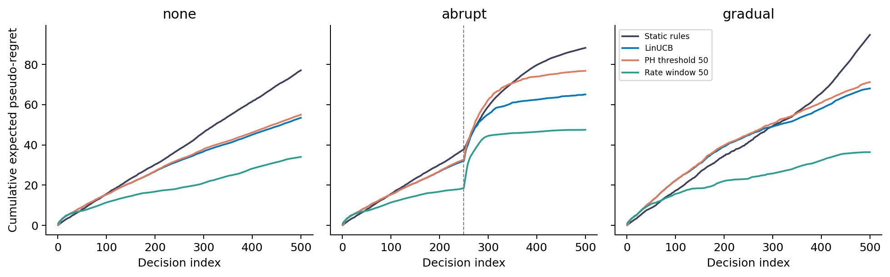
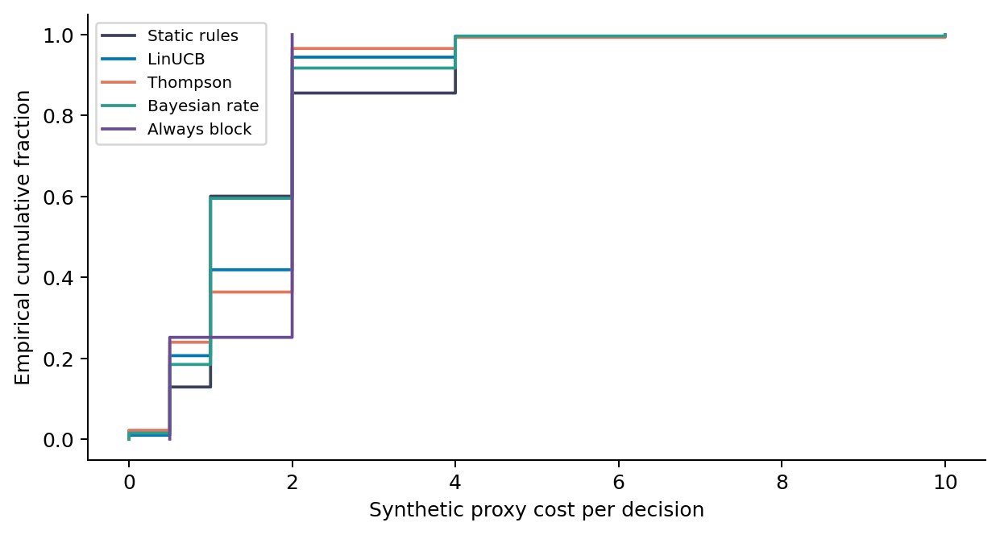
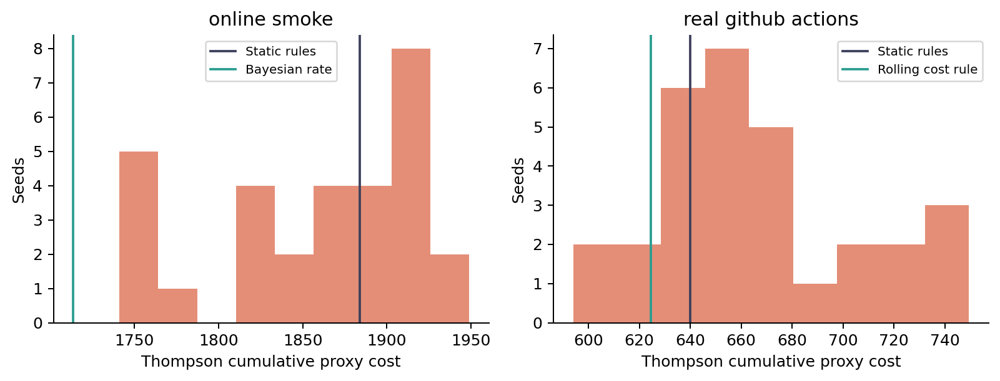
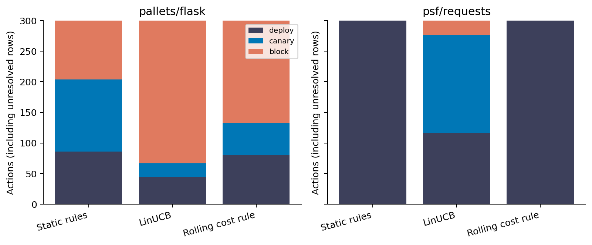
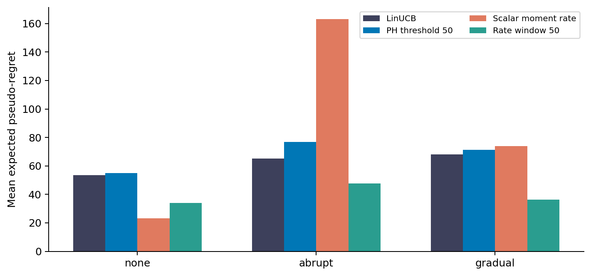
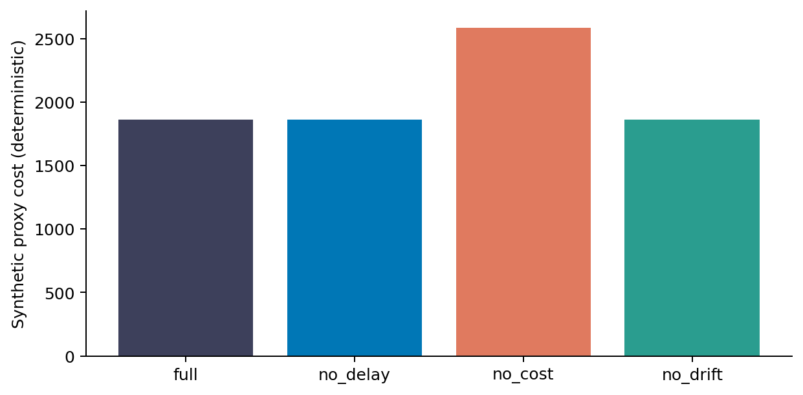

# Scope

This supplement replaces all numerical tables and figures from the original submission. The source-of-truth file and machine-readable artifacts define the corrected numerical record. Original materials are retained under review/original. These are simulation experiments, not causal release-cost estimates.

# Full replay conditions

## artificial default delay

| Policy | Mean cost | Sample SD | 95% seed CI |
| --- | --- | --- | --- |
| Always block | 1,865 | 0 | 1,865 to 1,865 |
| Always canary | 2,020 | 0 | 2,020 to 2,020 |
| Always deploy | 2,900 | 0 | 2,900 to 2,900 |
| Bayesian rate | 1,713 | 0 | 1,713 to 1,713 |
| Rolling cost rule | 2,085 | 0 | 2,085 to 2,085 |
| Heuristic | 2,288 | 0 | 2,288 to 2,288 |
| LinUCB | 1,877.5 | 0 | 1,877.5 to 1,877.5 |
| Bias-only LinUCB | 1,735 | 0 | 1,735 to 1,735 |
| LinUCB wrapper | 1,877.5 | 0 | 1,877.5 to 1,877.5 |
| Static rules | 1,929 | 0 | 1,929 to 1,929 |
| Thompson | 1,889.6 | 52.9 | 1,871 to 1,908.7 |

## online smoke

| Policy | Mean cost | Sample SD | 95% seed CI |
| --- | --- | --- | --- |
| Always block | 1,865 | 0 | 1,865 to 1,865 |
| Always canary | 2,020 | 0 | 2,020 to 2,020 |
| Always deploy | 2,900 | 0 | 2,900 to 2,900 |
| Bayesian rate | 1,713.5 | 0 | 1,713.5 to 1,713.5 |
| Rolling cost rule | 1,970.5 | 0 | 1,970.5 to 1,970.5 |
| Heuristic | 2,325 | 0 | 2,325 to 2,325 |
| LinUCB | 1,863 | 0 | 1,863 to 1,863 |
| Bias-only LinUCB | 1,739 | 0 | 1,739 to 1,739 |
| LinUCB wrapper | 1,863 | 0 | 1,863 to 1,863 |
| Static rules | 1,884 | 0 | 1,884 to 1,884 |
| Thompson | 1,857.1 | 62.6 | 1,835.2 to 1,878.5 |

## real github actions

| Policy | Mean cost | Sample SD | 95% seed CI |
| --- | --- | --- | --- |
| Always block | 1,027 | 0 | 1,027 to 1,027 |
| Always canary | 836 | 0 | 836 to 836 |
| Always deploy | 860 | 0 | 860 to 860 |
| Bayesian rate | 669 | 0 | 669 to 669 |
| Rolling cost rule | 624.5 | 0 | 624.5 to 624.5 |
| Heuristic | 860 | 0 | 860 to 860 |
| LinUCB | 779 | 0 | 779 to 779 |
| Bias-only LinUCB | 650 | 0 | 650 to 650 |
| LinUCB wrapper | 779 | 0 | 779 to 779 |
| Static rules | 640 | 0 | 640 to 640 |
| Thompson | 665.7 | 39.8 | 652.1 to 680.1 |

## robustness high failure

| Policy | Mean cost | Sample SD | 95% seed CI |
| --- | --- | --- | --- |
| Always block | 1,865 | 0 | 1,865 to 1,865 |
| Always canary | 3,180 | 0 | 3,180 to 3,180 |
| Always deploy | 5,800 | 0 | 5,800 to 5,800 |
| Bayesian rate | 1,865 | 0 | 1,865 to 1,865 |
| Rolling cost rule | 2,425.5 | 0 | 2,425.5 to 2,425.5 |
| Heuristic | 4,115 | 0 | 4,115 to 4,115 |
| LinUCB | 1,972 | 0 | 1,972 to 1,972 |
| Bias-only LinUCB | 1,905 | 0 | 1,905 to 1,905 |
| LinUCB wrapper | 1,972 | 0 | 1,972 to 1,972 |
| Static rules | 2,578 | 0 | 2,578 to 2,578 |
| Thompson | 1,955.8 | 27.2 | 1,946.1 to 1,965.5 |

## robustness long delay

| Policy | Mean cost | Sample SD | 95% seed CI |
| --- | --- | --- | --- |
| Always block | 1,865 | 0 | 1,865 to 1,865 |
| Always canary | 2,020 | 0 | 2,020 to 2,020 |
| Always deploy | 2,900 | 0 | 2,900 to 2,900 |
| Bayesian rate | 1,713 | 0 | 1,713 to 1,713 |
| Rolling cost rule | 2,077 | 0 | 2,077 to 2,077 |
| Heuristic | 2,319 | 0 | 2,319 to 2,319 |
| LinUCB | 1,973 | 0 | 1,973 to 1,973 |
| Bias-only LinUCB | 1,777.5 | 0 | 1,777.5 to 1,777.5 |
| LinUCB wrapper | 1,973 | 0 | 1,973 to 1,973 |
| Static rules | 1,924 | 0 | 1,924 to 1,924 |
| Thompson | 1,917 | 61.6 | 1,895.5 to 1,939.3 |

## robustness low block

| Policy | Mean cost | Sample SD | 95% seed CI |
| --- | --- | --- | --- |
| Always block | 1,005 | 0 | 1,005 to 1,005 |
| Always canary | 2,020 | 0 | 2,020 to 2,020 |
| Always deploy | 2,900 | 0 | 2,900 to 2,900 |
| Bayesian rate | 1,005 | 0 | 1,005 to 1,005 |
| Rolling cost rule | 1,273.5 | 0 | 1,273.5 to 1,273.5 |
| Heuristic | 2,325 | 0 | 2,325 to 2,325 |
| LinUCB | 1,072 | 0 | 1,072 to 1,072 |
| Bias-only LinUCB | 1,024 | 0 | 1,024 to 1,024 |
| LinUCB wrapper | 1,072 | 0 | 1,072 to 1,072 |
| Static rules | 1,591 | 0 | 1,591 to 1,591 |
| Thompson | 1,069.6 | 20 | 1,062.8 to 1,076.9 |

## robustness short delay

| Policy | Mean cost | Sample SD | 95% seed CI |
| --- | --- | --- | --- |
| Always block | 1,865 | 0 | 1,865 to 1,865 |
| Always canary | 2,020 | 0 | 2,020 to 2,020 |
| Always deploy | 2,900 | 0 | 2,900 to 2,900 |
| Bayesian rate | 1,714.5 | 0 | 1,714.5 to 1,714.5 |
| Rolling cost rule | 1,949 | 0 | 1,949 to 1,949 |
| Heuristic | 2,294 | 0 | 2,294 to 2,294 |
| LinUCB | 1,950 | 0 | 1,950 to 1,950 |
| Bias-only LinUCB | 1,750 | 0 | 1,750 to 1,750 |
| LinUCB wrapper | 1,950 | 0 | 1,950 to 1,950 |
| Static rules | 1,853.5 | 0 | 1,853.5 to 1,853.5 |
| Thompson | 1,909.6 | 51.3 | 1,891.8 to 1,927.9 |

# Page Hinkley calibration

Fixed deploy, IID failure labels, 1,150 observations, seeds 1000-1029. The selected threshold is 400; selection criterion is no more than 10% of streams with any alarm in each of two null cells. This finite-sample screen is not a theoretical error bound.

| Threshold | Failure rate | Mean alarms | Fraction with any alarm |
| --- | --- | --- | --- |
| 20 | 0.1 | 14.9 | 1.000 |
| 20 | 0.35 | 26.5 | 1.000 |
| 50 | 0.1 | 3.5 | 0.967 |
| 50 | 0.35 | 8.5 | 1.000 |
| 100 | 0.1 | 0.7 | 0.533 |
| 100 | 0.35 | 2.2 | 0.867 |
| 200 | 0.1 | 0 | 0.000 |
| 200 | 0.35 | 0.4 | 0.367 |
| 400 | 0.1 | 0 | 0.000 |
| 400 | 0.35 | 0 | 0.033 |
| 800 | 0.1 | 0 | 0.000 |
| 800 | 0.35 | 0 | 0.000 |

# Drift evaluation

Mean cumulative expected pseudo-regret uses all 500 decisions. Realized costs exclude a common censored-delay mask. Terminal observations are included in cost evaluation but not in model learning. The moment-rate control accounts for the synthetic canary multiplier; CI replay controls assume an action-independent label.

| Policy | Stationary | Abrupt | Gradual |
| --- | --- | --- | --- |
| Static rules | 77.1 | 88.3 | 94.7 |
| LinUCB | 53.5 | 65.1 | 68.1 |
| Thompson | 66.9 | 70.8 | 79.5 |
| PH threshold 50 | 55 | 76.8 | 71.2 |
| PH threshold 400 | 53.5 | 65.1 | 68.1 |
| Scalar moment rate | 23.2 | 163.1 | 73.8 |
| Rate window 50 | 34.1 | 47.5 | 36.4 |
| Rate window 100 | 31.5 | 64.6 | 34.7 |

{width=95%}

{width=95%}

{width=95%}

{width=95%}

{width=95%}

{width=95%}

# Reproducibility

Run the commands in the root README from a clean checkout. The frozen CSV hashes and code hashes are in corrected/manifest.json. This run used Python 3.13 and the exact dependency versions in requirements-audit.txt. The main build scripts use Pandoc and a TeX installation.

# Remaining limitations

The synthetic fixture generator is unavailable. The real export lacks collection provenance and workflow identities; it cannot be interpreted as independent deployment decisions. Deterministic policy repetition does not supply dataset uncertainty. Hyperparameter sensitivity is exploratory on the same export. Real opportunity costs, deployment incidents, action-dependent censoring and policy effects on future releases are unmeasured. The original empirical operating-boundary claim is withdrawn.
